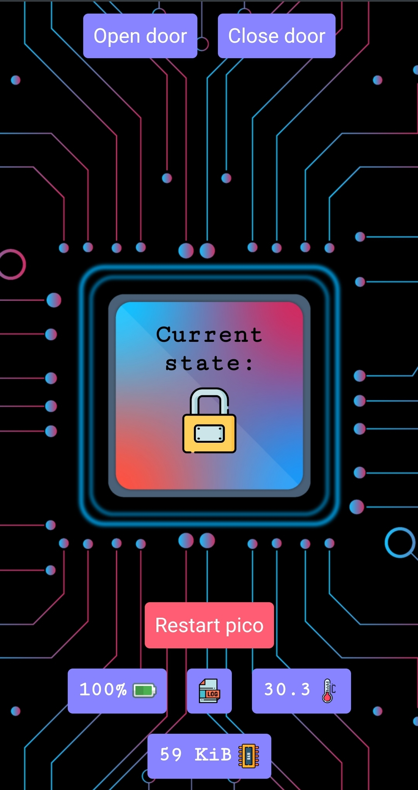

# Door project
This project is used to automatically open and close a door via wifi by controlling it with a website. 
Below you can take a look at the circuit and the website. As the microcontroller, a raspberry pico is used, which
does the job very well for its small size and cheap price. There is also a backup system using an old powerbank if there is no
electricity. When the wifi doesn't work, the pico searches for my personal hotspot from my phone, so that i can still open it.
At the time of this writing, this construction has never failed in 4 months, but we will see how long it takes until something breaks.

Website                          |  Circuit
:-------------------------------:|:-------------------------------:
  |  
